# Projekt 195: Złapać Świat

> Dziennik z próby odwiedzenia wszystkich 195 krajów świata.

Projekt 195 to blog podróżniczy człowieka, który od 2012 roku zbiera pieczątki z każdego kraju świata. Na liście jest
104 z 195 krajów: każdy ma własną relację, zdjęcia, tabelę faktów i render globusa z zaznaczonym miejscem. Do tego
interaktywny globus 3D na zdjęciach satelitarnych NASA, kolekcje tematyczne, podział na kontynenty i strona główna,
która zaczyna się od widoku z okna samolotu. Podróżnik i jego historie są fikcyjne, miejsca są prawdziwe.

Całość to statyczna strona w Astro 7. Bez backendu, bazy danych, ciasteczek i analityki. Animacje robi GSAP z płynnym
przewijaniem Lenis, globus na stronie głównej rysuje d3-geo na canvasie, a ten na `/globus/` to własny renderer WebGL
bez three.js. Treści to pliki markdown, a zdjęcia pochodzą z Wikimedia Commons na wolnych licencjach.

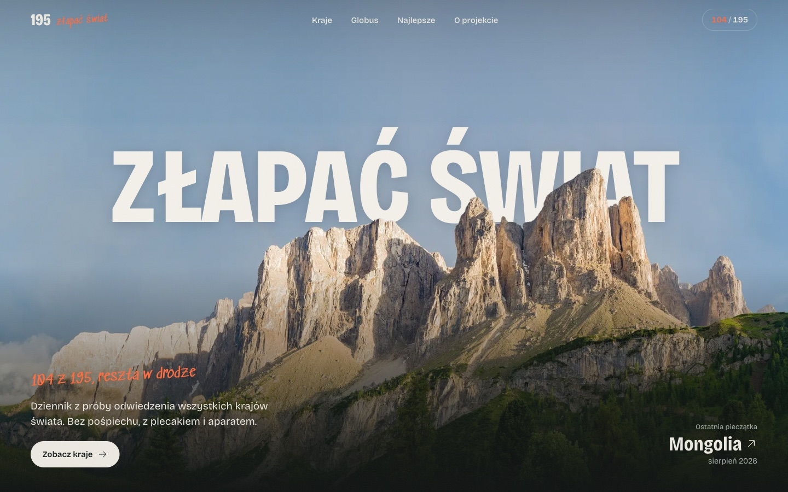

## Dla kogo

- **Dla autorów blogów podróżniczych i portfolio**, którzy chcą szybkiej, statycznej strony z treścią w plikach
  markdown, zamiast WordPressa czy płatnego kreatora. Nowy kraj to jeden plik i dwie komendy.
- **Dla frontendowców**, którzy szukają działających przykładów: intro na osi czasu GSAP, tytułu schowanego między
  warstwami zdjęcia, rozsuwanych zdjęć sterowanych przewijaniem, globusa WebGL z wybieraniem krajów po pikselu
  i mapy identyfikatorów w teksturze. Kod jest krótki i bez frameworka UI.
- **Jako szablon projektu „odwiedzam wszystko”**: listę 195 krajów można zamienić na parki narodowe, szczyty Korony
  Gór czy stadiony, a liczniki, kolekcje i globus zostają.

Nie jest to CMS ani serwis społecznościowy: nie ma panelu, kont, komentarzy, newslettera ani formularzy. To świadomy
wybór, dzięki któremu strona nie przetwarza danych odwiedzających.

## Jak to działa

```
src/content/kraje/*.md ───┐
src/data/countries.json ──┤
src/data/photos.json ─────┼──► src/lib/data.ts ──► strony Astro (src/pages) ──► dist/  statyczny HTML
src/data/alts.json ───────┤          │                    │
src/data/meta.ts ─────────┘          │                    ├──► /data/globe.json, /data/earth.json
                                     │                    ├──► /sitemap.xml, /robots.txt
src/assets/photos/*/*.webp ──────────┘                    └──► obrazki WebP w kilku szerokościach
                                     (astro:assets)            i kadry Open Graph 1200×630

scripts/*.mjs  (uruchamiane ręcznie, lokalnie)
  fetch-photos     ──► src/assets/photos, src/data/photos.json   (Wikimedia Commons API)
  build-countries  ──► src/data/countries.json                   (world-countries)
  build-earth      ──► public/img/earth, public/img/globes       (NASA Blue Marble + world-atlas)
  hero-cutout      ──► public/img/hero                           (wycięcie pierwszego planu)
```

**Podczas builda** Astro czyta pliki markdown z krajami, łączy je z listą 195 krajów, metadanymi i opisami zdjęć,
a potem generuje 124 strony HTML, statyczne pliki JSON dla obu globusów, mapę strony i `robots.txt`. Zdjęcia są
konwertowane do WebP w kilku szerokościach (`srcset`), a dla każdej podstrony powstaje kadr Open Graph 1200×630.

**W przeglądarce** JavaScript odpowiada wyłącznie za ruch: `src/scripts/app.ts` uruchamia Lenis, odsłanianie
elementów i dzielenie nagłówków na linie, `Hero.astro` prowadzi intro, `globe.ts` rysuje globus na stronie głównej,
a `earth.ts` globus WebGL. Bez JavaScriptu wszystkie treści nadal są widoczne.

**Wejście na stronę główną** wygląda tak:

1. Skrypt w `<head>` sprawdza `prefers-reduced-motion` i znacznik `p195-intro-seen` w `sessionStorage`. Jeśli intro
   było już widziane w tej karcie albo użytkownik wyłączył animacje, intro jest pomijane od razu, bez mignięcia.
2. Intro: okno samolotu przybliża się, kamera wlatuje w chmury, światło przechodzi w kolory nieba z hero.
   Kliknięcie, klawisz albo przewinięcie przyspiesza animację czterokrotnie.
3. Oś czasu czeka, aż warstwy hero i fonty będą wczytane, i dopiero wtedy odsłania stronę. Litery tytułu wjeżdżają
   od dołu między tło a wycięty grzbiet gór, więc chowają się za skałami.
4. Dalej działa przewijanie: Lenis i ScrollTrigger sterują paralaksą, licznikami i odsłanianiem sekcji.
5. Globus w sekcji „Mapa pieczątek” wczytuje się dopiero, gdy jest blisko ekranu (`IntersectionObserver`).

**Globus WebGL** na `/globus/` liczy w shaderze rzut ortograficzny odwrotnie, piksel po pikselu, i pobiera kolor
z tekstury NASA. Druga tekstura to mapa identyfikatorów: każdy piksel ma wartość równą indeksowi kraju. Dzięki temu
podświetlanie, obrysy i wybieranie kraju kliknięciem działają bez geometrii 3D. Szpilki są rysowane na osobnym canvasie 2D.

## Funkcje

| Adres | Co to jest |
|---|---|
| `/` | Intro z okna samolotu, tytuł za grzbietem gór, manifest z licznikami, ostatnie pieczątki, globus z kartą pokładową, lista najlepszych, kontynenty, kolekcje jako polaroidy |
| `/kraje/` | Wszystkie odwiedzone kraje z filtrem kontynentu, wyszukiwarką i sortowaniem, poniżej kraje, które czekają |
| `/kraje/:slug/` | Rozsuwane zdjęcia, relacja, tabela faktów z globusem NASA, tablica korkowa ze zdjęciami, poprzedni i następny kraj |
| `/globus/` | Globus 3D: obrót, przybliżanie, wyszukiwarka, lista według kontynentów, karta kraju z linkiem do relacji |
| `/kontynenty/:slug/` | Sześć kontynentów: odwiedzone kraje i lista pozostałych |
| `/kolekcje/:slug/` | Najlepsze, wyspiarskie, góry, pustynie, dzika przyroda, tropiki |
| `/o-projekcie/` | Historia projektu, statystyki i zasady liczenia krajów |
| `/polityka-prywatnosci/`, `/regulamin/` | Dokumenty prawne, linki w stopce |
| `/zrodla-zdjec/` | Autorzy i licencje wszystkich zdjęć i danych (`noindex`, link z regulaminu) |
| `/404` | Strona błędu z tablicą korkową i podpowiedziami |
| `/sitemap.xml`, `/robots.txt` | Mapa strony i reguły dla robotów |
| `/data/globe.json`, `/data/earth.json` | Dane dla globusów, opisane w dokumentacji |

**SEO i dostępność**

- Każda strona ma własny tytuł, opis, adres kanoniczny i komplet tagów Open Graph i Twitter z obrazkiem 1200×630.
- Mapa strony obejmuje wszystkie strony bez `noindex`. `robots.txt` wskazuje na mapę.
- Wszystkie 327 zdjęć ma polski tekst alternatywny (`src/data/alts.json`). Puste `alt` mają tylko elementy czysto
  dekoracyjne: chmury w intro, rozmyta warstwa nieba w hero i podglądy dublujące zdjęcia obok.
- `prefers-reduced-motion` wyłącza intro, płynne przewijanie, paralaksę i obrót globusa.
- Ikony: `favicon.svg`, `favicon.ico` (16, 32, 48 px) i `apple-touch-icon.png`.

## Zrzuty ekranu

### Strona główna

| Intro: okno samolotu | Ostatnie pieczątki |
|---|---|
|  | 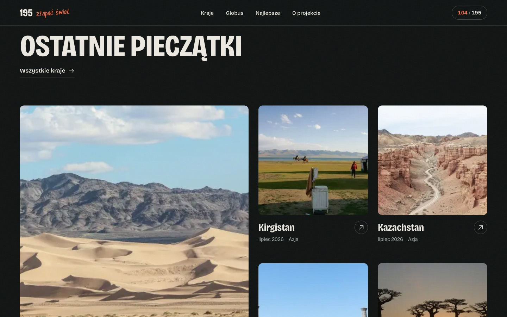 |

| Mapa pieczątek | Najlepsze |
|---|---|
| 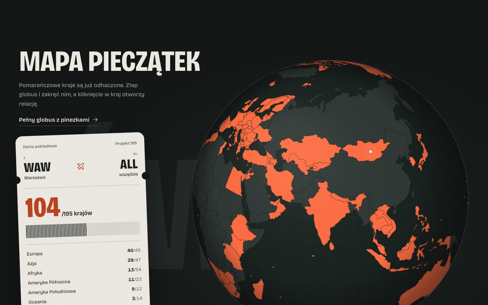 | 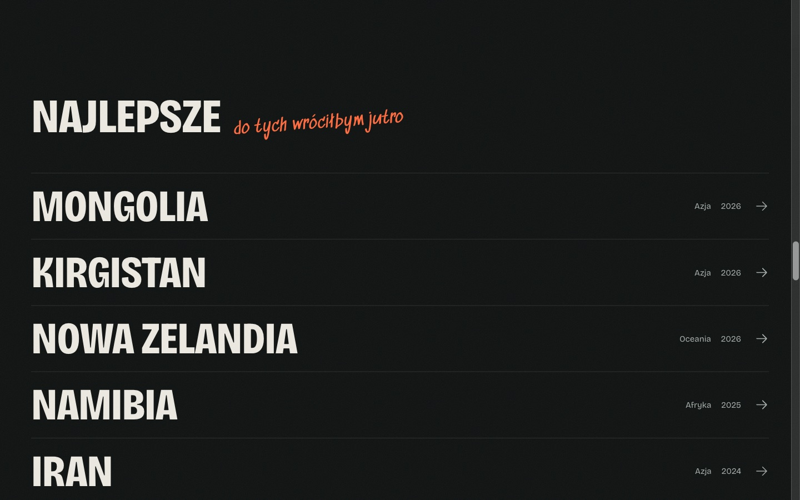 |

| Kontynenty | Kolekcje |
|---|---|
| 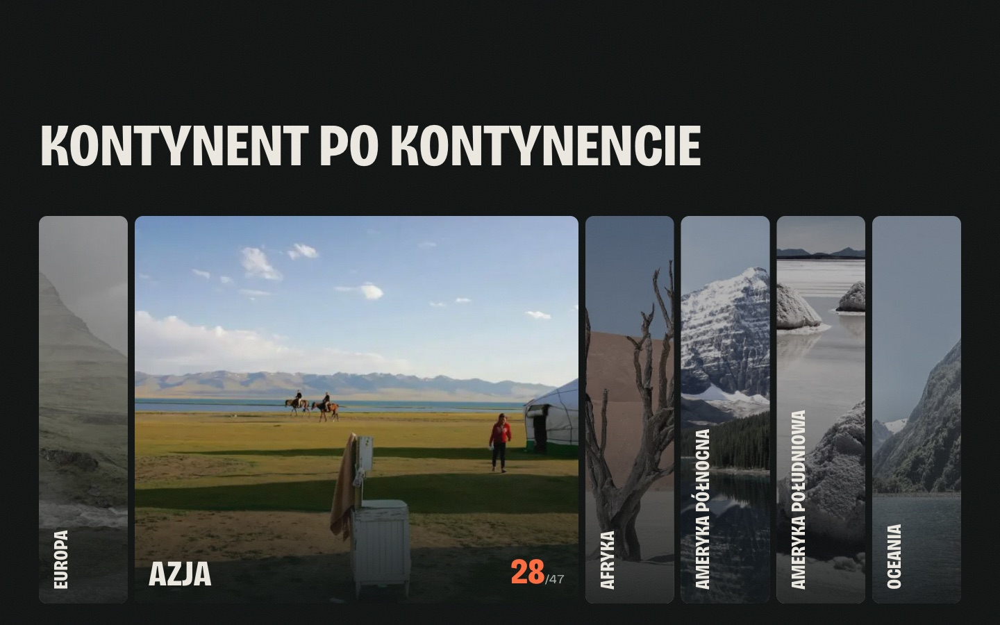 | 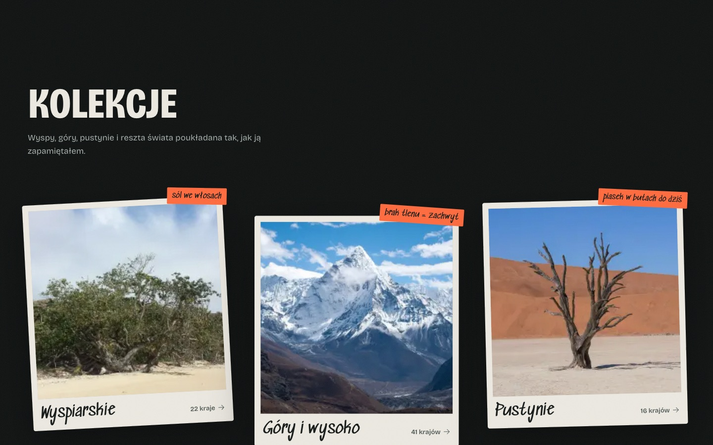 |

### Strona kraju

| Zdjęcia złączone | Zdjęcia rozsunięte przewijaniem |
|---|---|
| 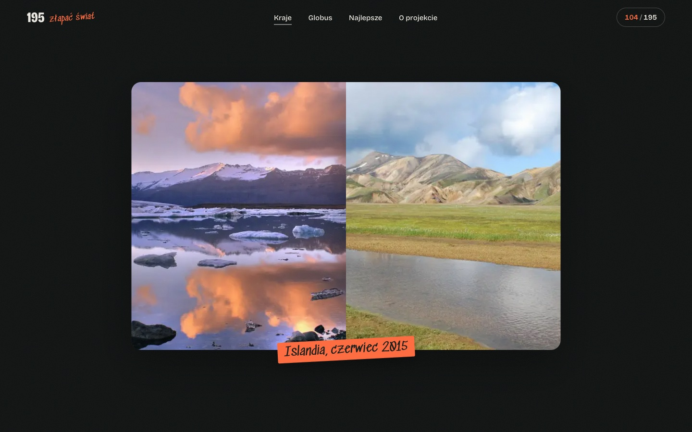 | 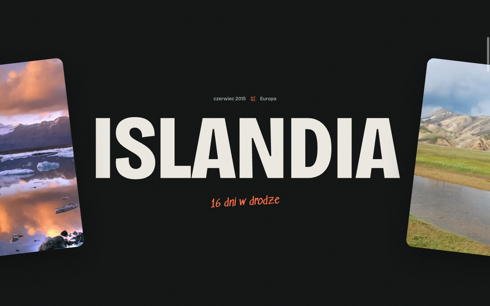 |

| Relacja i fakty | Tablica ze zdjęciami |
|---|---|
| 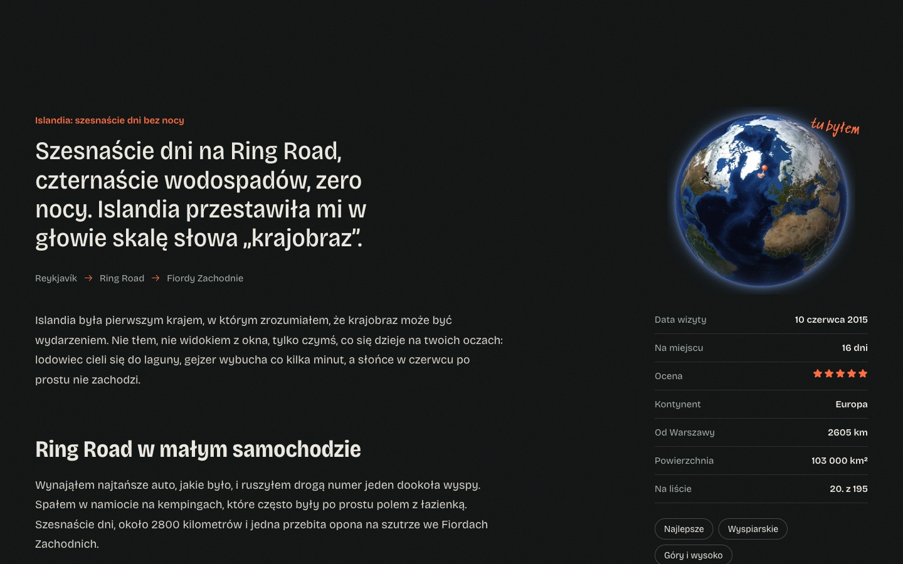 | 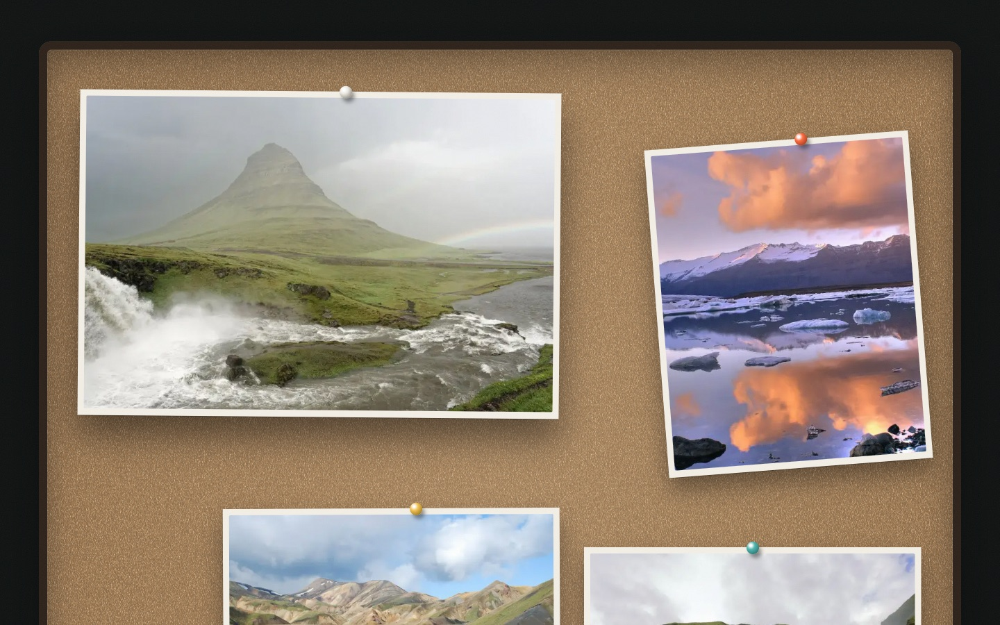 |

### Pozostałe strony

| Globus 3D | Lista krajów |
|---|---|
| 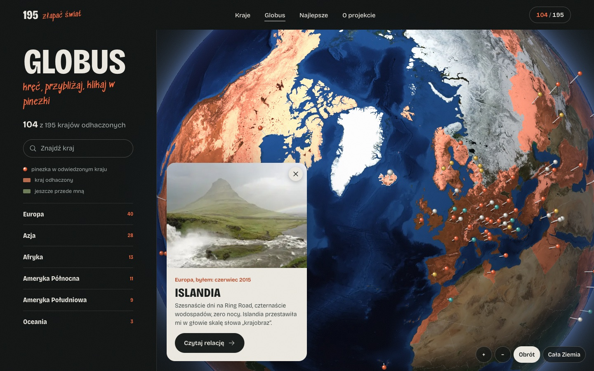 | 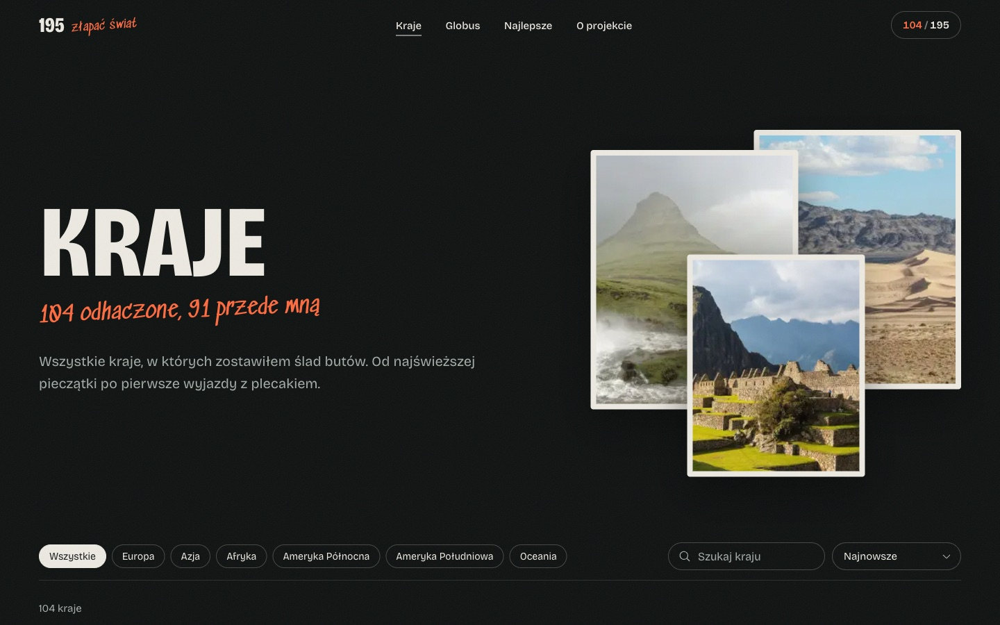 |

| Kolekcja | Kontynent |
|---|---|
| 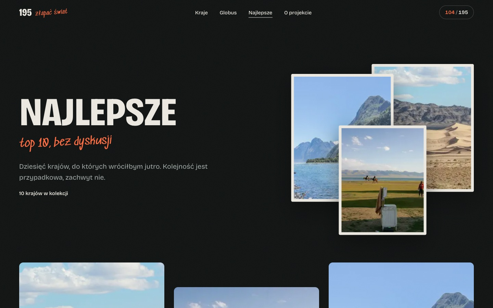 | 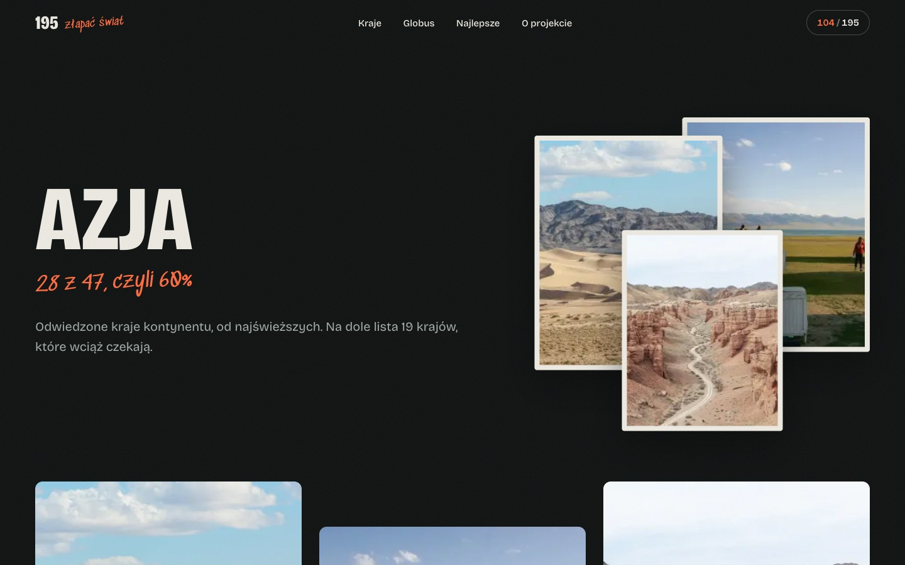 |

| Polityka prywatności | Strona 404 |
|---|---|
|  | 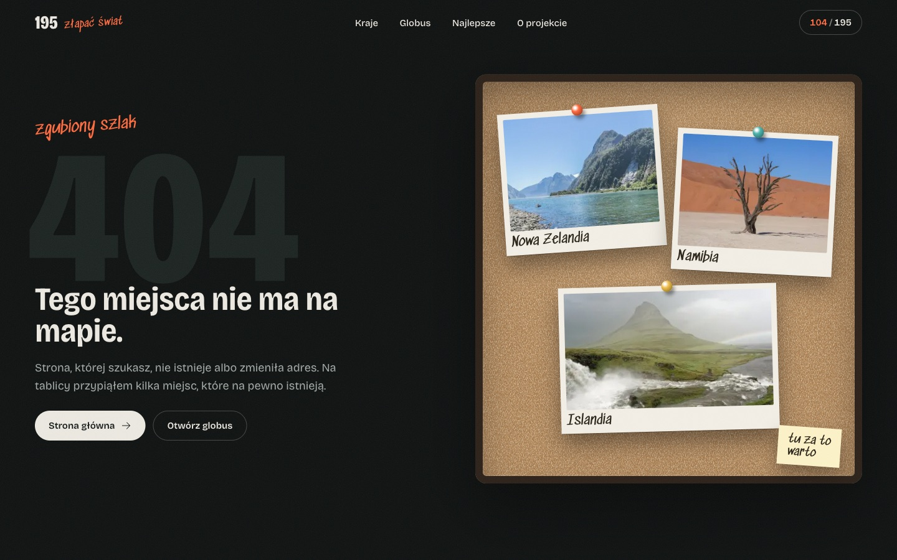 |

### Telefon

| Strona główna | Strona kraju | Globus |
|---|---|---|
| 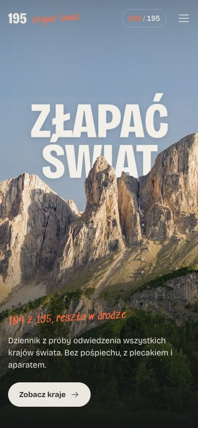 | 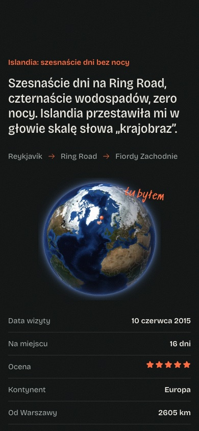 | 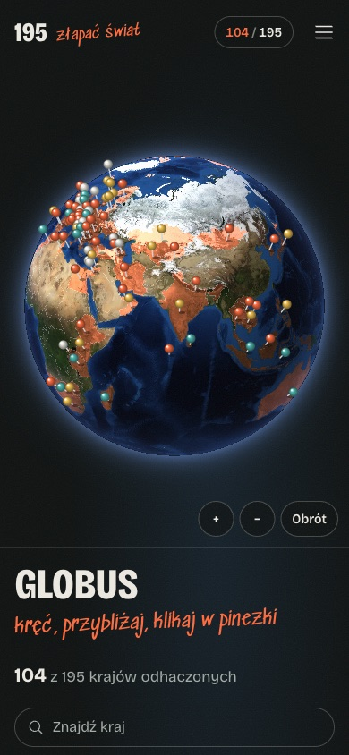 |

Podróżnik, relacje, daty wizyt i oceny są fikcyjne. Zdjęcia są prawdziwe i pochodzą z Wikimedia Commons.

## Uruchomienie

Wymagany Node.js 22.12 lub nowszy.

```bash
npm install
npm run dev
```

Strona działa pod `http://localhost:4321`. Build produkcyjny trafia do `dist/` i można go wrzucić na dowolny hosting
statyczny (Netlify, Cloudflare Pages, Vercel, GitHub Pages).

```bash
npm run build
npm run preview
```

| Skrypt | Co robi |
|---|---|
| `npm run dev` | Serwer deweloperski z przeładowaniem na żywo |
| `npm run build` | Build statyczny do `dist/` |
| `npm run preview` | Podgląd zbudowanej strony |
| `npx astro check` | Sprawdzenie typów w plikach `.astro` i `.ts` |
| `npm run photos` | Pobiera brakujące zdjęcia z Wikimedia Commons (`-- --only=ISL` dla jednego kraju, `-- --force` od nowa) |
| `npm run photos:meta` | Odświeża autorów i licencje już pobranych zdjęć |
| `npm run countries` | Generuje listę 195 krajów z polskimi nazwami |
| `npm run hero` | Wycina pierwszy plan zdjęcia hero i generuje warstwy |
| `npm run earth` | Tekstury Ziemi, mapy identyfikatorów krajów i rendery globusów |
| `npm run globes` | Tylko rendery globusów dla odwiedzonych krajów |

Skrypty generujące zapisują wyniki do repozytorium, więc do zwykłego builda nie są potrzebne. Uruchamia się je tylko
po zmianie zdjęć, listy krajów albo źródłowych tekstur.

## Konfiguracja

Jedyna zmienna środowiskowa to adres strony. Wzór jest w `.env.example`, a sam `.env` jest w `.gitignore`.

| Zmienna | Opis |
|---|---|
| `SITE_URL` | Pełny adres strony bez końcowego ukośnika. Używany w adresach kanonicznych, Open Graph, `sitemap.xml` i `robots.txt`. Domyślnie `https://projekt195.pl`. **Ustaw przed wdrożeniem.** |

Pozostałe ustawienia są w `src/data/meta.ts`: nazwa i hasło strony, adres kontaktowy z dokumentów prawnych
(`site.email`), następny cel podróży, kontynenty, kolekcje i nawigacja.

## Jak dodać kraj

1. Utwórz `src/content/kraje/<slug>.md`. Slug i kod ISO3 są w `src/data/countries.json`.
2. Uzupełnij frontmatter: `country`, `visited`, `days`, `rating`, `excerpt` i opcjonalnie `title`, `route`, `tags`,
   `top`, `photoSearch` (2 do 5 haseł, najlepiej nazwy miejsc). Pod frontmatterem napisz relację w markdownie.
3. `npm run photos -- --only=ISO3` pobiera zdjęcia, autorów i licencje. Nietrafione zdjęcie wyklucz w
   `scripts/photo-overrides.json` i uruchom skrypt ponownie.
4. Dopisz polskie opisy nowych zdjęć do `src/data/alts.json` (klucz to ścieżka pliku, np. `isl/1.webp`).
   Bez tego zdjęcie dostanie jako `alt` angielski tytuł z Commons.
5. `npm run globes` generuje render globusa z zaznaczonym krajem.
6. `npm run build`. Strona kraju, wpisy na listach, globusy, liczniki i mapa strony zaktualizują się same.

Pełny opis pól jest w [dokumentacji](docs/api-documentation.pdf).

## Struktura

```
src/
  content/kraje/*.md     jeden plik = jeden odwiedzony kraj (frontmatter + relacja)
  content.config.ts      schemat frontmattera (zod)
  data/                  countries.json (195 krajów), photos.json (autorzy i licencje),
                         alts.json (polskie opisy zdjęć), meta.ts (kontynenty, kolekcje, nawigacja)
  assets/photos/         zdjęcia krajów, przetwarzane przez astro:assets
  lib/                   data.ts (wizyty, statystyki, formatowanie), og.ts (kadry Open Graph)
  layouts/               Base.astro (meta, Open Graph), Legal.astro (dokumenty prawne)
  components/            nagłówek, stopka, karty, nagłówki stron; home/ to sekcje strony głównej
  pages/                 strony, endpointy data/*.json, sitemap.xml, robots.txt, 404
  scripts/               app.ts, motion.ts (GSAP, Lenis), globe.ts (canvas), earth.ts (WebGL)
  styles/global.css      tokeny, typografia, przyciski
public/
  img/hero, img/intro    warstwy hero i chmury intro
  img/earth, img/globes  tekstury i mapy identyfikatorów, rendery globusów krajów
  og/                    obrazki Open Graph strony głównej i globusa
  data/world-110m.json   granice dla globusa na stronie głównej
scripts/                 generatory zdjęć, listy krajów, hero i tekstur (Node + sharp)
docs/
  api-documentation.pdf / .html   dokumentacja endpointów, modelu treści i skryptów
  screenshots/                    zrzuty ekranu używane w README
```

## Bezpieczeństwo i prywatność

- Strona jest w pełni statyczna: nie ma serwera aplikacji, bazy danych, formularzy ani kont, więc nie ma czego
  zaatakować poza samym hostingiem.
- Brak ciasteczek, analityki, reklam i wtyczek zewnętrznych. Fonty, zdjęcia i skrypty są serwowane z tej samej domeny.
- Jedyny zapis w przeglądarce to znacznik `p195-intro-seen` w `sessionStorage`, który znika po zamknięciu karty.
- W repozytorium nie ma kluczy ani sekretów. Skrypty pobierające zdjęcia korzystają z publicznego API Wikimedia
  bez uwierzytelniania.
- Na hostingu warto ustawić nagłówki `Content-Security-Policy`, `X-Content-Type-Options` i `Referrer-Policy`.

## Wydajność

- Domyślnie zero JavaScriptu: skrypty dotyczą wyłącznie animacji i globusów. Cały JS strony to około 73 kB po
  kompresji gzip, z czego większość to GSAP z Lenis. CSS to około 11 kB, a HTML strony głównej około 9 kB.
- Zdjęcia są w WebP w kilku szerokościach z `srcset` i `loading="lazy"`. Warstwy hero są wczytywane z wyprzedzeniem.
- Globus na stronie głównej i jego dane ładują się dopiero przy przewinięciu w jego pobliże. Globus WebGL wybiera
  teksturę 2048 albo 4096 px zależnie od ekranu.
- Build generuje 124 strony, około 1650 wariantów zdjęć i 104 kadry Open Graph. Katalog `dist/` ma około 270 MB,
  prawie w całości są to warianty zdjęć. Mieści się to w limitach popularnych hostingów statycznych.

## Licencje

- **Kod**: licencja MIT, pełny tekst w [`LICENSE`](LICENSE). Obejmuje kod źródłowy, style, skrypty i konfigurację.
  Nie obejmuje treści i materiałów wymienionych niżej, które mają własne licencje.
- **Relacje**: teksty w `src/content/kraje/` i opisy na stronach należą do autora, wszystkie prawa zastrzeżone.
  Krótkie cytaty z podaniem źródła są w porządku, kopiowanie całych relacji wymaga zgody.
- **Zdjęcia krajów**: 327 plików z Wikimedia Commons na licencjach CC BY, CC BY-SA, CC0 i z domeny publicznej.
  CC BY i CC BY-SA wymagają podania autora, licencji i źródła, dlatego strona `/zrodla-zdjec/` musi pozostać
  dostępna (link jest w regulaminie). Generuje się sama z `src/data/photos.json`.
- **Hero**: zdjęcie grupy Sella autorstwa Wolfganga Morodera, CC BY-SA 3.0. Wycięte warstwy są utworem zależnym
  i obowiązuje je ta sama licencja.
- **Chmury w intro**: Kaushik Panchal, CC0.
- **Globus**: NASA Blue Marble, domena publiczna. Granice: world-atlas z Natural Earth, domena publiczna.
- **Dane krajów**: `src/data/countries.json` powstał z bazy world-countries na licencji ODbL 1.0 i jest udostępniany
  na tej samej licencji. Wymóg podania źródła spełnia strona źródeł i regulamin.
- **Fonty**: Bricolage Grotesque i Sedgwick Ave na licencji SIL OFL 1.1. **Ikony**: Phosphor, MIT.
  **GSAP**: darmowa licencja standardowa.
- **Treść**: podróżnik i relacje są wymyślone, miejsca i pory roku są prawdziwe.

Jeśli używasz tego repozytorium jako szablonu, podmień relacje na własne i zachowaj informacje o autorach zdjęć
(stronę `/zrodla-zdjec/`) albo zastąp zdjęcia swoimi.

## Dokumentacja

- [`docs/api-documentation.pdf`](docs/api-documentation.pdf) (wersja HTML obok): endpointy JSON, mapa strony,
  model treści kraju, pliki danych, skrypty generujące i kolejność kroków przy dodawaniu kraju.
